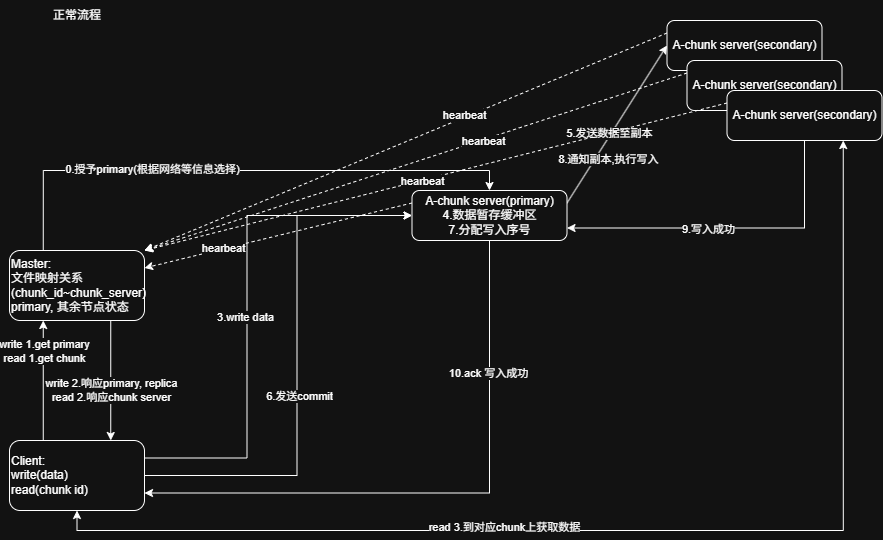
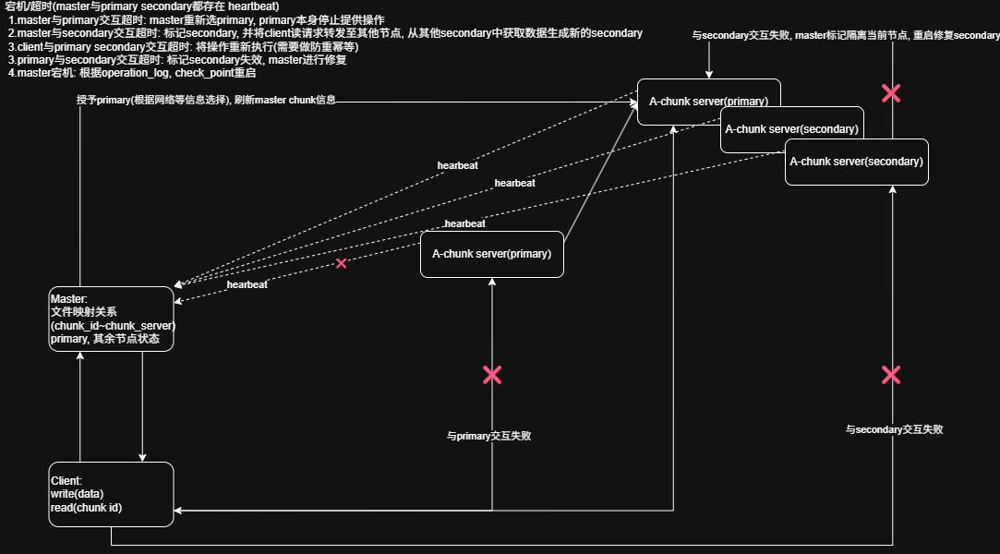

# GFS（Google File System）工程实践总结

---

# 0. 背景与设计目标

GFS 是典型的工业级分布式文件系统，其设计核心并非追求强一致性，而是在工程约束下实现**高可用 + 高吞吐 + 可恢复性**。

其系统假设包括：

- 组件会频繁故障（常态故障模型）
- 网络延迟不可预测
- 节点规模大，人工干预成本高
- 一致性可以放宽（弱一致性 / 最终一致）

## 核心能力目标

- **节点快速检测**
  - 基于 heartbeat 的存活检测机制
- **故障隔离**
  - 自动标记 dead node，避免参与读写路径
- **自动修复**
  - 自动重建副本（replication）
  - 故障节点重启后自动重新加入系统

---

# 1. 系统组件设计

GFS 采用典型 master + chunkserver + client 架构。

---

## 1.1 Master（元数据控制平面）

Master 是整个系统的控制中心，维护全局状态，但不参与数据传输。

### 主要职责

### （1）Chunk 映射管理
- 维护 `file → chunk → chunkserver` 映射关系
- 记录 chunk 的副本分布位置
- 管理 chunk ID 与版本信息

### （2）复制策略（Replication Policy）
- 决定副本数量（通常为 3）
- 控制副本分布（跨机架 / 跨机房）
- 触发副本补偿（re-replication）

### （3）故障恢复
- 检测副本丢失
- 触发重新复制
- 维护副本健康状态

### （4）Lease 管理
- 为 primary chunkserver 分配 lease
- 控制写入主节点的唯一性
- 防止写冲突

---

## 1.2 ChunkServer（数据存储节点）

ChunkServer 是真正存储数据的节点。

### 基本特性

- 每个 chunk 默认大小：**64MB**
- 每个 chunk 通常有 **3 份副本**
- 存储真实数据，不负责全局协调

### Primary 角色（动态角色）

某个 chunk replica 在特定 lease 期间可被 master 选为 primary：

- 选择依据：
  - heartbeat 正常
  - 数据版本最新
- 职责：
  - 对写请求进行全局排序
  - 将写操作转发给 secondary replicas
  - 保证同一 chunk 写入顺序一致

> 注意：primary 是“临时角色”，不是固定节点属性

---

## 1.3 Client（客户端）

Client 是数据访问主体：

- 向 master 请求 metadata
- 直接与 chunkserver 进行数据读写
- 不依赖 master 进行数据路径传输（避免瓶颈）

---

# 2. 读写流程详解

---

## 2.1 读取流程（Read Path）

读操作是典型的 **master 控制 + data plane 直连 chunkserver**：

1. Client → Master  
   请求 chunk 位置信息（file offset → chunk mapping）

2. Master → Client  
   返回 chunkserver 列表（包含多个 replica）

3. Client → ChunkServer  
   直接访问最近或负载最低的 replica 读取数据

### 特点

- master 不参与数据传输
- 读取路径水平扩展性强
- 可选 replica 提升容错能力

---

## 2.2 写入流程（Write Path）

写入路径较复杂，核心是 **primary ordering + pipeline replication**：

### 写入步骤

1. Client → Master
  - 获取：
    - primary chunkserver
    - secondary replicas 列表
    - chunk version 信息

2. Client → ChunkServers（数据推送阶段）
  - client 先将数据 push 到所有 replica（pipeline 或并行）

3. Client → Primary（写指令阶段）
  - 发送 write request

4. Primary：
  - 对写操作进行排序（global ordering）
  - 按顺序转发给 secondary replicas

5. Secondary：
  - 执行写入
  - 返回 ACK 给 primary

6. Primary：
  - 收集 ACK
  - 返回最终 ACK 给 client

### 本质机制

- primary = 顺序控制点（ordering authority）
- secondary = 执行副本
- client = 数据驱动方（data push + command trigger）

---

# 3. 宕机与异常处理机制

GFS 的容错依赖 heartbeat + lease + versioning。

---

## 3.1 Master 与 Primary 超时

- Master 未收到 primary heartbeat
  - 判定 primary 失效
  - 重新选举新的 primary
  - 旧 primary 强制失效（丧失 lease）

---

## 3.2 Master 与 Secondary 超时

- Secondary heartbeat 超时：
  - 标记为 dead replica
  - 从 replication group 移除
  - 触发 re-replication
  - 从健康副本复制数据恢复

---

## 3.3 Client 与 ChunkServer 超时

- Client 失败处理：
  - 自动 retry
  - 重新请求 master 获取 metadata
  - 重放操作（必须保证幂等性）

### 关键点

- 写操作必须具备：
  - request ID
  - version check
  - 幂等控制

---

## 3.4 Primary 与 Secondary 失败

- Secondary 写失败：
  - 标记该 replica invalid
  - master 触发修复流程
  - 从其他副本恢复数据

---

## 3.5 Master 宕机

Master 是系统关键点：

恢复依赖：

- operation log（操作日志）
- checkpoint（快照）

恢复流程：

1. replay log
2. load checkpoint
3. rebuild metadata state
4. 恢复 chunk mapping

---

# 4. 为什么 GFS 没有 Split-Brain

Split-brain 的本质是：多个节点同时认为自己是 primary。

GFS 通过以下机制规避：

## 4.1 lease 机制（单权威授权）

- master 唯一授予 primary lease
- lease 有明确过期时间
- 旧 primary 在 lease 过期后自动失效

## 4.2 centralized authority

- master 是唯一授权源
- 不存在 peer-to-peer leader election

## 4.3 写路径依赖 master

- client 必须从 master 获取 primary
- 无法绕过 master 直接写

## 4.4 结论

系统设计上是**中心化授权模型**，而不是分布式选举模型，因此不会出现经典 split-brain。

---

# 5. GFS 设计思想总结

## 5.1 数据层

- chunk-based storage
- 大文件切分
- 顺序读写优化

## 5.2 冗余机制

- multi-replica（通常 3 副本）
- 自动修复（self-healing）

## 5.3 写入模型

- primary-based ordering
- pipeline replication
- 弱一致性保证

## 5.4 一致性模型

- relaxed consistency
- eventual consistency for failures
- 强一致仅在单 chunk 写序内成立

---

# 6. 设计局限与工程问题

## 6.1 无法严格证明系统状态正确性

- 异步 + 故障模型复杂
- 存在短暂不一致窗口

## 6.2 Master 单点问题

- master 是瓶颈 + 单点风险
- 后续系统（如 Colossus / HDFS HA）做了改进

## 6.3 Heartbeat 扩展性问题

- 节点规模增加 → O(N) heartbeat 放大
- 网络与 master 压力显著上升

## 6.4 Lease 规模化问题

- lease 管理依赖时间
- clock skew 会影响正确性
- 大规模系统难以维持稳定 lease 语义

## 6.5 时间不可靠性

- 分布式系统中 clock 不是全局可靠变量
- lease 依赖物理时间 → 存在理论风险窗口

---

# 总结

GFS 的核心不是“严格正确性”，而是：

> 在可接受的不一致窗口内，换取极高的工程可用性与吞吐能力

其设计奠定了现代大规模分布式存储系统的基本范式：
- 控制面 / 数据面分离
- primary ordering
- 自动修复机制
- 弱一致性 + 高可用优先
